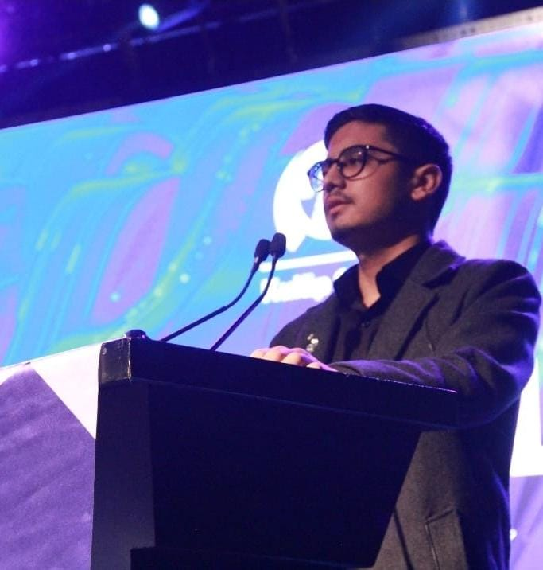

<html lang="tr">
<head>
  <meta charset="UTF-8" />
  <meta name="viewport" content="width=device-width,initial-scale=1,viewport-fit=cover" />
  <title>umut.hany | CV</title>
  <meta name="description" content="Mobil öncelikli CV & Portfolyo — Umuthan “.exe” Yalçınkaya" />

  
</head>

<body>
  

    <header class="topbar">
      

        
        <strong>umut.hany</strong>
      

      <nav class="inlineNav">
        <a href="#about">Hakkımda</a>
        <a href="#edu">Eğitim</a>
        <a href="#exp">Deneyim</a>
        <a href="#awards">Ödüller</a>
        <a href="#skills">Yetenekler</a>
        <a href="#contact">İletişim</a>
      </nav>

      <button class="burger" id="burger" aria-label="Menüyü aç">
        
      </button>
    </header>

    

      

      

        

          <button class="closeBtn" id="closeBtn">Kapat</button>
        

        <h3>Menü</h3>
        

          <a href="#about" class="mLink">Hakkımda</a>
          <a href="#edu" class="mLink">Eğitim</a>
          <a href="#exp" class="mLink">Deneyim</a>
          <a href="#awards" class="mLink">Ödüller</a>
          <a href="#skills" class="mLink">Yetenekler</a>
          <a href="#contact" class="mLink">İletişim</a>
        

      

    

    <!-- HERO -->
    <section class="hero card reveal">
      

        
Portfolyoma Hoşgeldiniz

        <!-- Fotoğraf: assets/profile.jpg (attığın foto burada) -->
        

          

            Fotoğraf Yükle';">
          

          

            Öğrenci • Öğretmen • Asistan 
            Araştırmacı • Proje Danışmanı 
            Mentör • E-Sporcu
          

        

      

      <h1>Umuthan “.exe” Yalçınkaya</h1>

      

        Yazılım, Robotik, Otomasyon, Gömülü Sistemler, Yapay Zeka, 3D Modelleme, Tarih, Jeoloji ve Coğrafya, Din ve Dinler Tarihi,
        Felsefe ve Düşünce Biçimi, Şiir ve Hikâye Yazarı, Astronomi, Kuantum Fiziği, Uzay-Zaman, Hayvan Moleküler Genetiği,
        Bitki Moleküler Genetiği, Oyun ve Animasyon Yapımı, Anatomi, Kimya ve Atom Yapısı
      

      <!-- Tagler alt alta -->
      

        Marmara Üniversitesi - Kontrol ve Otomasyon
        Anadolu Üniversitesi - Bilgisayar Programcılığı
        Dijital İkiz ve Otonom Teknolojiler - Kulüp Başkanı
        Team Flux - Takım Kaptanı
        Marmara Üniversitesi - Asistan
        Marmara Üniversitesi - Proje Danışmanı
        Team Simurg - Takım Kaptanı
        SIMURG Öğrenci Topluluğu - Başkan
        Techno-Rob Takım Kaptanı
        DeeX3D Baskı - Kurucu
        TUBİTAK - Araştırmacı
        T3 Vakfı - Eğitmen
        İst-İnka - Takım Kaptanı
        İngilizce - B2
        Arapça - B1
        Latince - B1
        Farsca - B2
        Rusca - B2
        Azerice - C1
      

      

        <a class="btn primary" href="#contact">İletişim</a>
        <a class="btn" href="https://github.com/YOUR_GITHUB_USERNAME" target="_blank" rel="noreferrer">GitHub</a>
        <a class="btn" href="https://www.instagram.com/umut.hany" target="_blank" rel="noreferrer">Instagram</a>
      

    </section>

    <!-- ABOUT -->
    <section id="about" class="section card reveal">
      <h2>Hakkımda</h2>

      

        

          Merhaba, ben Umuthan Yalçınkaya. 21 Ağustos 2005 tarihinde doğdum. Doğduğum günden itibaren alışılmışın dışında olmam,
          sıradan bir hayatım olmayacağını belli ediyordu.
        

        

          İlkokul yıllarında bilime dair ilk adımlarımı attım. Henüz 9 yaşımdayken Kocaeli’de düzenlenen Darobotica Ortaokul/Lise
          robotik yarışmasına dört dalda, dört robotla katıldım ve üç birincilik ile bir ikincilik kazanarak ilimizde önde gelen
          liseleri ve ortaokulları geride bıraktım.
        

        

          8. sınıfta kimyaya olan merakım ve Oktanyum hocamızın eğitimiyle TEKNOFEST’te birincilik kazandıran “En Verimli Roket Yakıtı”
          ödülünü elde ettim. 14 yaşımda, fizik hocamın yönlendirmesiyle TÜBİTAK’ta gönüllü araştırmacı olarak çalışmaya başladım.
          Aynı yıl okulun FRC takımı Techno-Rob’da programmer olarak görev aldım. İki yıl üst üste FRC yarışmasına katıldık; bir yıl
          şampiyon, diğer yıl finalist olarak tamamladık.
        

        

          16 yaşımda KodeLig ve hackathon yarışmalarını üst üste birinciliklerle tamamladım. 17 yaşımda ise okulun alt sınıflarından
          oluşan ekiplere mentörlük desteği vererek yarışmalara hazırladım; toplamda dokuz takıma, on iki kupa kazandırarak okulumuzun
          başarı grafiğine katkı sağladım.
        

        

          18 yaşımda “Geri Dönüştürülmüş Malzemelerden Elektrikli Araba” projesini hayata geçirdim ve neredeyse sıfır maliyetle
          elektrikli bir araç inşa ettim. Bu proje ile TEKNOFEST “Bağımsız Projeler” dalında ikincilik kazandım.
        

        

          20 yaşıma kadar geçen süreçte onlarca farklı makale ve tez yazarak araştırmacı kimliğimi güçlendirdim. 20 yaşımda Marmara
          Üniversitesi’nde DIOT Kulübü’nü, hem eğitim veren hem de yarışmalara hazırlayan bir yapı olarak kurdum. Ardından SIMURG
          Öğrenci Topluluğu’nu kurarak İTÜ, YTÜ, GTÜ, Yeditepe Üniversitesi, Bahçeşehir Üniversitesi ve Marmara Üniversitesi arasında
          bir network ağı oluşturdum; öğrencilerin ve kulüplerin kaynaşmasını sağladım.
        

        

          Bu topluluklardan önde gelen başarılı öğrencilerle Team Simurg ve İst-İnka TEKNOFEST ekiplerini kurdum. Aynı yıl üniversite
          idaresinden gelen asistan öğrencilik teklifini kabul ettim; laboratuvar derslerinde ve öğrenci projelerinde destek veren
          yarı-eğitmen sorumluluğunu üstlendim.
        

        

          2025–2026 sezonunda, batarya verimliliğini artırmaya yönelik kendi tasarımım bir projenin patentini aldım; proje Bayraktar
          İHA’larında kullanılması için revize edildi. Ayrıca “Nörolojik Duygu Ağına Sahip Yapay Zeka” projemin lisansını ve patentini
          TÜBİTAK’tan aldım. Bu yıl içinde okulun TEKNOFEST, bitirme, ders ve bağımsız projelerini desteklemek adına “Proje Danışmanı”
          olarak göreve başladım. Yine aynı yıl içinde Team Flux başta olmak üzere beş TEKNOFEST takımı kurdum.
        

        

          Bunca yıl ve proje süreci içerisinde, aynı zamanda 15 yıllık Counter-Strike oyun serüvenimin son 5 yılını profesyonel
          e-sporcu olarak geçirdim. Goliath Gaming ve Eternal Fire Academy gibi takımlarda forma giymemin yanı sıra, CS:GO döneminde
          ESEA League 21, 22 ve 23 sezonlarında şampiyonluklar elde ettim. CS2 European Pro League’de ise takımımın da katkılarıyla
          şampiyonluk başarısı yakaladık.
        

      

      

        <button class="moreBtn" data-toggle="aboutClamp" data-label-open="Devamını Oku" data-label-close="Kısalt">
          Devamını Oku
        </button>
      

    </section>

    <!-- EDUCATION -->
    <section id="edu" class="section card reveal">
      <h2>Eğitim</h2>

      

        

          

            
            
15 Temmuz Şehitler Fen Lisesi - Sayısal

            
10 Eylül 2019 – 1 Kasım 2022 • GNO: 89.05

            
Sayısal alan, yarışma ve proje odaklı dönem.

          

          

            
            
MEB Açıköğretim Lisesi

            
1 Aralık 2022 – 1 Haziran 2023 • GNO: 99.5

            
Lise tamamlandı.

          

          

            
            
Marmara Üniversitesi - Kontrol ve Otomasyon Teknolojisi

            
23 Ağustos 2024 – Devam • GNO: 85/100

            
Kontrol, otomasyon, uygulamalı mühendislik altyapısı.

          

          

            
            
Anadolu Üniversitesi - Bilgisayar Programcılığı (AÖF)

            
13 Eylül 2025 – Devam

            
Yazılım temelleri + pratik geliştirme odağı.

          

        

      

      

        <button class="moreBtn" data-toggle="eduClamp" data-label-open="Devamını Oku" data-label-close="Kısalt">
          Devamını Oku
        </button>
      

    </section>

    <!-- EXPERIENCE -->
    <section id="exp" class="section card reveal">
      <h2>Deneyim</h2>

      

        

          

            
            
Kulüp Başkanı — Dijital İkiz ve Otonom Teknolojiler

            
Kasım 2024 – Devam

            
Kulüp operasyonu, ekip koordinasyonu, proje ve etkinlik süreçleri.

          

          

            
            
Asistan — Marmara Üniversitesi

            
Kasım 2024 – Devam

            
Laboratuvar dersleri ve öğrenci projelerinde teknik destek.

          

          

            
            
Eğitmen — T3 Vakfı

            
Aralık 2025 – Devam

            
Deneyap Atölyelerinde eğitmenlik.

          

          

            
            
Araştırmacı / Proje Uzmanı — TÜBİTAK

            
2019 – Devam

            
Uzmanlık alanları hakkında TÜBİTAK adına bilimsel çalıştaylara katılım ve projeler yürütülmesi.

          

          

            
            
Kurucu — DeeX 3D Baskı

            
Nisan 2022 – Ağustos 2023

            
3D baskı ve modelleme atölyesi kurmak.

          

        

      

      

        <button class="moreBtn" data-toggle="expClamp" data-label-open="Devamını Oku" data-label-close="Kısalt">
          Devamını Oku
        </button>
      

    </section>

    <!-- AWARDS -->
    <section id="awards" class="section card reveal">
      <h2>Ödüller / Yarışmalar</h2>

      

        

          

            
            
Darobotica — Mini Sumo (1.’lik)

            
~ 2014–2016 (yaklaşık)

            
Robotik yarışması kapsamında birincilik.

          

          

            
            
Darobotica — Çizgi İzleyen (1.’lik)

            
~ 2014–2016 (yaklaşık)

            
Robotik yarışması kapsamında birincilik.

          

          

            
            
Darobotica — Labirent Çözen (1.’lik)

            
~ 2014–2016 (yaklaşık)

            
Robotik yarışması kapsamında birincilik.

          

          

            
            
Darobotica — (2.’lik)

            
~ 2014–2016 (yaklaşık)

            
Robotik yarışması kapsamında ikincilik.

          

          

            
            <p
